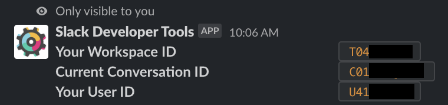

# Finding your Slack Team and Channel ID

To open Slack channels in the **@ys** application you must provide a Slack Team and Channel ID. This information is not readily provided within Slack. To get this information you will need to download the Slack developer tools to query your Slack workspace information.

- Download and install the [Slack Developer Tools](https://sdt.builtbyslack.com)
- Within the Slack channel you wish to get the ID for (e.g. #general) type `/sdt whoami`

The tool will produce something like the following:

Now go back to **@ys** and place the Workspace ID `T04...` value in the `Team` field, and the `Current Conversation ID` value `C01...` into the `Channel` field.
